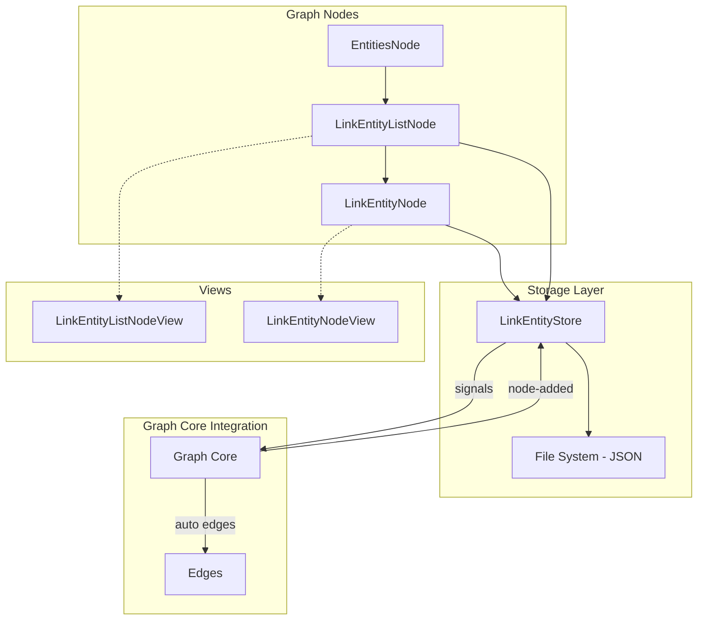

# Link Entities

Link entities provide a mechanism to link arbitrary graph nodes together by key, with automatic edge creation when both source and target nodes are present in the graph.

## Architecture Overview



## Storage Layer

### LinkEntityStore

**File:** [link.fnl](file:///home/sam/pj/space/assets/lua/entities/link.fnl)

The `LinkEntityStore` manages persistence of link entities to disk using JSON files.

#### Storage Format

Each entity is stored as a `.json` file in `<user-data-dir>/entities/link/`:

```json
{
  "id": "<uuid>",
  "source-key": "<node-key>",
  "target-key": "<node-key>",
  "created-at": <unix-timestamp>,
  "metadata": { ... }
}
```

#### API

| Method | Description |
|--------|-------------|
| `create-entity(opts)` | Creates a new entity with optional `source-key`, `target-key`, `metadata` |
| `get-entity(id)` | Retrieves entity by ID |
| `update-entity(id, updates)` | Updates entity fields |
| `delete-entity(id)` | Removes entity from cache and disk |
| `list-entities()` | Returns all entities, sorted by `created-at` (newest first) |
| `find-edges-for-nodes(keys)` | Returns entities where both source AND target are in the keys set |

#### Signals

The store emits signals for entity lifecycle events:

- `link-entity-created` — Emitted when a new entity is created
- `link-entity-updated` — Emitted when an entity is modified
- `link-entity-deleted` — Emitted when an entity is deleted

#### Singleton Access

```fennel
(local LinkEntityStore (require :entities/link))
(local store (LinkEntityStore.get-default))
```

---

## Graph Nodes

### LinkEntityNode

**File:** [link-entity.fnl](file:///home/sam/pj/space/assets/lua/graph/nodes/link-entity.fnl)

Represents a single link entity in the graph.

- **Key:** Entity ID
- **Label:** `"<source-key> → <target-key>"` (truncated)
- **Color:** Pale yellow (`glm.vec4 0.7 0.65 0.3 1`)

| Method | Description |
|--------|-------------|
| `get-entity()` | Returns current entity data |
| `update-source(key)` | Update source node key |
| `update-target(key)` | Update target node key |
| `update-metadata(data)` | Update metadata |
| `delete-entity()` | Delete entity (node auto-removes from graph) |

### LinkEntityListNode

**File:** [link-entity-list.fnl](file:///home/sam/pj/space/assets/lua/graph/nodes/link-entity-list.fnl)

Displays a paginated list of all link entities.

- **Key:** `"link-entity-list"`
- **Label:** `"link entities"`
- **Color:** Pale yellow

| Method | Description |
|--------|-------------|
| `collect-items()` | Returns `[[entity, label], ...]` for all entities |
| `emit-items()` | Broadcasts items via `items-changed` signal |
| `create-entity(opts)` | Creates entity and refreshes list |
| `add-entity-node(entity)` | Adds a child `LinkEntityNode` to the graph |

---

## Views

### LinkEntityNodeView

**File:** [link-entity.fnl](file:///home/sam/pj/space/assets/lua/graph/view/views/link-entity.fnl)

Editor for a link entity with selection integration.

**Layout:**
1. **Source row** — Input field + "Use Selected" button
2. **Swap button** — Exchanges source and target values
3. **Target row** — Input field + "Use Selected" button
4. **Metadata** — Read-only multiline display of JSON metadata
5. **Delete button** — Removes the entity

**Behavior:**
- "Use Selected" buttons populate the input with the key of the currently selected node (if exactly 1 node is selected)
- Swap button exchanges source and target keys
- Inputs call `node:update-source/target` on change

### LinkEntityListNodeView

**File:** [link-entity-list.fnl](file:///home/sam/pj/space/assets/lua/graph/view/views/link-entity-list.fnl)

List view with create button and search.

**Layout:**
1. **Create button** — Creates new entity and opens its node
2. **SearchView** — Paginated list; clicking opens entity node

---

## Graph Core Integration

**File:** [core.fnl](file:///home/sam/pj/space/assets/lua/graph/core.fnl)

The graph core automatically manages edges based on link entities:

### Automatic Edge Creation

When a node is added to the graph:
1. Graph queries `LinkEntityStore.find-edges-for-nodes(all-node-keys)`
2. For each link entity where both source and target nodes exist in the graph, an edge is created

### Signal Handling

| Signal | Action |
|--------|--------|
| `link-entity-created` | Create edge if both nodes exist |
| `link-entity-updated` | Remove old edge, create new if applicable |
| `link-entity-deleted` | Remove edge if it exists |

### Edge Tracking

The graph maintains a `link-edge-map` that tracks which edges were created from link entities (entity-id → edge-key mapping).

---

## Menu Manager Integration

**File:** [menu-manager.fnl](file:///home/sam/pj/space/assets/lua/menu-manager.fnl)

A "Create Link Entity" action is available in the root context menu:
- If exactly 2 nodes are selected, source and target keys are pre-populated from the selection (first node → source, second node → target)
- Creates a `LinkEntityNode` and adds it to the graph

---

## EntitiesNode Integration

**File:** [entities.fnl](file:///home/sam/pj/space/assets/lua/graph/nodes/entities.fnl)

The `EntitiesNode` includes "link" as an available entity type alongside "string".

---

## Testing

### Unit Tests

**File:** [test-link-entities.fnl](file:///home/sam/pj/space/assets/lua/tests/test-link-entities.fnl)

Covers:
- Store CRUD operations
- Signal emission
- Metadata persistence
- `find-edges-for-nodes` query
- Node and view module loading
- Node property initialization
- EntitiesNode includes link type

### E2E Snapshot

**File:** [test-link-entity-view.fnl](file:///home/sam/pj/space/assets/lua/tests/e2e/test-link-entity-view.fnl)

Creates a snapshot of the `LinkEntityNodeView` rendered in a dialog with sample data.

---

## File Summary

| File | Purpose |
|------|---------|
| [entities/link.fnl](file:///home/sam/pj/space/assets/lua/entities/link.fnl) | Storage layer (JSON) |
| [graph/nodes/link-entity.fnl](file:///home/sam/pj/space/assets/lua/graph/nodes/link-entity.fnl) | Single entity node |
| [graph/nodes/link-entity-list.fnl](file:///home/sam/pj/space/assets/lua/graph/nodes/link-entity-list.fnl) | Entity list node |
| [graph/nodes/entities.fnl](file:///home/sam/pj/space/assets/lua/graph/nodes/entities.fnl) | Updated to include link type |
| [graph/view/views/link-entity.fnl](file:///home/sam/pj/space/assets/lua/graph/view/views/link-entity.fnl) | Entity editor view |
| [graph/view/views/link-entity-list.fnl](file:///home/sam/pj/space/assets/lua/graph/view/views/link-entity-list.fnl) | List view |
| [graph/core.fnl](file:///home/sam/pj/space/assets/lua/graph/core.fnl) | Graph integration |
| [menu-manager.fnl](file:///home/sam/pj/space/assets/lua/menu-manager.fnl) | Context menu action |
| [tests/test-link-entities.fnl](file:///home/sam/pj/space/assets/lua/tests/test-link-entities.fnl) | Unit tests |
| [tests/e2e/test-link-entity-view.fnl](file:///home/sam/pj/space/assets/lua/tests/e2e/test-link-entity-view.fnl) | E2E snapshot test |
