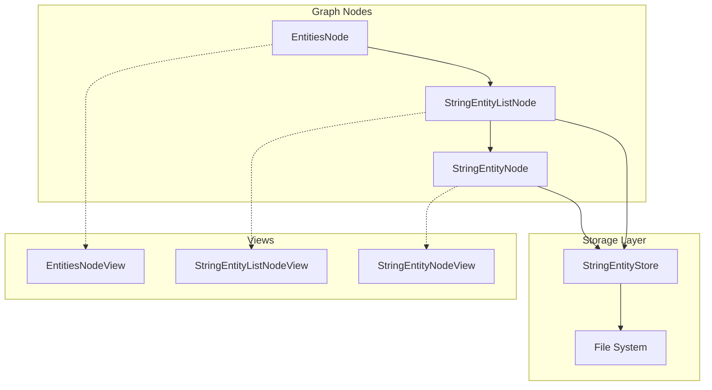

# String Entities

String entities provide a simple persistent storage system for text data, integrated with the graph UI for viewing and editing.

## Architecture Overview



## Storage Layer

### StringEntityStore

**File:** [string.fnl](file:///home/sam/pj/space/assets/lua/entities/string.fnl)

The `StringEntityStore` manages persistence of string entities to disk using markdown files with YAML frontmatter.

#### Storage Format

Each entity is stored as a `.md` file in `<user-data-dir>/entities/string/`:

```markdown
---
id: <uuid>
created-at: <unix-timestamp>
updated-at: <unix-timestamp>
---

<entity value text>
```

#### API

| Method | Description |
|--------|-------------|
| `create-entity(opts)` | Creates a new entity with optional `value`, returns entity |
| `get-entity(id)` | Retrieves entity by ID |
| `update-entity(id, updates)` | Updates entity fields, auto-updates `updated-at` |
| `delete-entity(id)` | Removes entity from cache and disk |
| `list-entities()` | Returns all entities, sorted by `updated-at` (newest first) |

#### Signals

The store emits signals for entity lifecycle events:

- `string-entity-created` — Emitted when a new entity is created
- `string-entity-updated` — Emitted when an entity is modified
- `string-entity-deleted` — Emitted when an entity is deleted

#### Singleton Access

```fennel
(local StringEntityStore (require :entities/string))
(local store (StringEntityStore.get-default))
```

---

## Graph Nodes

### EntitiesNode

**File:** [entities.fnl](file:///home/sam/pj/space/assets/lua/graph/nodes/entities.fnl)

Root node for browsing entity types. Currently supports only the "string" type.

- **Key:** `"entities"`
- **Label:** `"entities"`
- **Color:** Gray

Provides `collect-types` which returns available entity types, and `add-type-node` which creates a child list node for the selected type.

### StringEntityListNode

**File:** [string-entity-list.fnl](file:///home/sam/pj/space/assets/lua/graph/nodes/string-entity-list.fnl)

Displays a paginated list of all string entities.

- **Key:** `"string-entity-list"`
- **Label:** `"string entities"`
- **Color:** Dark green

| Method | Description |
|--------|-------------|
| `collect-items()` | Returns `[[entity, label], ...]` for all entities |
| `emit-items()` | Broadcasts items via `items-changed` signal |
| `create-entity(opts)` | Creates entity and refreshes list |
| `add-entity-node(entity)` | Adds a child `StringEntityNode` to the graph |

Automatically refreshes when the store emits create/update/delete signals.

### StringEntityNode

**File:** [string-entity.fnl](file:///home/sam/pj/space/assets/lua/graph/nodes/string-entity.fnl)

Represents a single string entity in the graph.

- **Key:** Entity ID
- **Label:** Truncated entity value (or ID if empty)
- **Color:** Dark blue

| Method | Description |
|--------|-------------|
| `get-entity()` | Returns current entity data |
| `update-value(new-value)` | Updates the entity's value |
| `delete-entity()` | Deletes the entity (node auto-removes from graph) |
| `refresh-label()` | Updates label from current value |

Listens to store signals:
- On delete: emits `entity-deleted` and removes self from graph
- On update: refreshes label

---

## Views

### EntitiesNodeView

**File:** [entities.fnl](file:///home/sam/pj/space/assets/lua/graph/view/views/entities.fnl)

Uses `SearchView` to display available entity types as buttons. Clicking a type calls `node:add-type-node(type-key)`.

### StringEntityListNodeView

**File:** [string-entity-list.fnl](file:///home/sam/pj/space/assets/lua/graph/view/views/string-entity-list.fnl)

Layout:
1. **Create button** — Calls `node:create-entity({})` then `node:add-entity-node(entity)`
2. **SearchView** — Paginated list of entities; clicking opens the entity node

### StringEntityNodeView

**File:** [string-entity.fnl](file:///home/sam/pj/space/assets/lua/graph/view/views/string-entity.fnl)

Layout:
1. **Action row** — Copy Value, Copy ID, Delete buttons
2. **Multiline input** — Editable text field bound to entity value

---

## Integration Points

### Start Node

**File:** [start.fnl](file:///home/sam/pj/space/assets/lua/graph/nodes/start.fnl)

The `EntitiesNode` is included in the start node's target list, making it accessible from the graph root.

### Menu Manager

**File:** [menu-manager.fnl](file:///home/sam/pj/space/assets/lua/menu-manager.fnl)

A "Create String Entity" action is available in the root menu, which:
1. Creates an entity via `StringEntityStore.get-default()`
2. Adds a `StringEntityNode` to the graph

---

## Testing

### Unit Tests

**File:** [test-string-entities.fnl](file:///home/sam/pj/space/assets/lua/tests/test-string-entities.fnl)

Covers:
- Store CRUD operations
- Signal emission (created, updated, deleted)
- Multiline value preservation
- Node and view module loading
- Node property initialization

### E2E Snapshot

**File:** [test-string-entity-view.fnl](file:///home/sam/pj/space/assets/lua/tests/e2e/test-string-entity-view.fnl)

Creates a snapshot of the `StringEntityNodeView` rendered in a dialog with sample multiline content.

---

## File Summary

| File | Purpose |
|------|---------|
| [entities/string.fnl](file:///home/sam/pj/space/assets/lua/entities/string.fnl) | Storage layer |
| [graph/nodes/entities.fnl](file:///home/sam/pj/space/assets/lua/graph/nodes/entities.fnl) | Entity type browser node |
| [graph/nodes/string-entity-list.fnl](file:///home/sam/pj/space/assets/lua/graph/nodes/string-entity-list.fnl) | Entity list node |
| [graph/nodes/string-entity.fnl](file:///home/sam/pj/space/assets/lua/graph/nodes/string-entity.fnl) | Single entity node |
| [graph/view/views/entities.fnl](file:///home/sam/pj/space/assets/lua/graph/view/views/entities.fnl) | Type browser view |
| [graph/view/views/string-entity-list.fnl](file:///home/sam/pj/space/assets/lua/graph/view/views/string-entity-list.fnl) | List view |
| [graph/view/views/string-entity.fnl](file:///home/sam/pj/space/assets/lua/graph/view/views/string-entity.fnl) | Entity editor view |
| [tests/test-string-entities.fnl](file:///home/sam/pj/space/assets/lua/tests/test-string-entities.fnl) | Unit tests |
| [tests/e2e/test-string-entity-view.fnl](file:///home/sam/pj/space/assets/lua/tests/e2e/test-string-entity-view.fnl) | E2E snapshot test |
