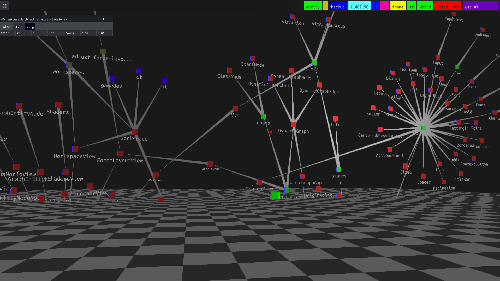

# Devlog Social Rendering

This note documents the current design for turning devlog markdown entries into social posts, the problems it fixes, the trade-offs we accepted, and the next steps if this area needs to become more capable.

## Problem

The canonical devlog source lives under `docs/dev/devlog/*.md`.

That format is correct for the docs site, but it is not correct as a direct transport format for chat/social targets:

- image markdown such as `` is valid in the docs, but Discord webhook `content` treats it as plain text
- relative links are meaningful relative to the source markdown file, but social targets need absolute public URLs
- the public user-facing destination is the generated devlog index page, not the per-entry markdown page
- different targets will eventually want different output constraints even when they share the same source content

This means the docs markdown should remain the canonical source, but publishing must render it into a target-safe representation instead of reusing the raw source verbatim.

## Current Design

Current files:

- `docs/scripts/publish-devlog.mjs`
- `docs/scripts/devlog-social-renderer.mjs`
- `docs/scripts/test-devlog-social-renderer.mjs`
- `docs/scripts/generate-devlog-index.mjs`

The current flow is:

1. `publish-devlog.mjs` reads each devlog entry from `docs/dev/devlog/*.md`.
2. Entry links published to users point at `/dev/devlog#<entry-id>`, not at `/dev/devlog/<entry-id>`.
3. `generate-devlog-index.mjs` emits explicit anchors into `docs/dev/devlog.md` so those public links land on the correct section.
4. `devlog-social-renderer.mjs` converts the entry body into social-safe plain text before it is sent to Discord or Matrix.

## Rendering Rules

The social renderer currently keeps the source markdown as input and renders a plain-text social representation with a small structured parser.

Important behavior:

- relative image links are resolved against the source entry path and converted to absolute public URLs
- image markdown becomes:
  - alt text on one line
  - absolute image URL on the next line
- markdown links become visible text plus absolute URL
- fenced code blocks are preserved
- simple lists are preserved
- blockquotes are preserved
- inline code spans are preserved
- final entry links use the public devlog anchor URL

Example:

Source markdown:

```md

```

Published social text:

```text
Space Prototype Screenshot
https://spaceui.org/dev/space-prototype-screenshot1.png
```

## Why This Design

This is intentionally a middle-ground design.

Why we did not keep the old approach:

- the original publisher used raw markdown body text in social payloads
- a quick regex rewrite was enough to prove the direction, but it was not robust enough to be the long-term implementation

Why we did not jump straight to a full markdown stack:

- the docs toolchain in this repo does not currently expose a simple direct markdown parser dependency for this script
- pulling in a full parser just for this workflow would add dependency and maintenance work that was not justified by the current content complexity

Why the current solution is acceptable:

- it cleanly separates canonical source content from publish-target rendering
- it fixes the real user-facing failures we saw in production
- it is tested
- it is easier to evolve into per-channel renderers later

## Trade-offs

This is better than regex rewriting, but it is still not a full CommonMark implementation.

Accepted trade-offs:

- the parser is purpose-built for the markdown subset we currently use in devlog entries
- unusual nested markdown constructs may still render imperfectly
- inline HTML is not treated as a first-class structured format
- different channels still share the same rendered text shape today

This is deliberate. The goal was to make the publisher correct for current content and clean enough to extend, without overbuilding.

## Current Test Coverage

`docs/scripts/test-devlog-social-renderer.mjs` covers:

- relative asset URL resolution
- markdown image rendering
- markdown link rendering
- fenced code blocks
- simple lists
- blockquotes
- inline code spans
- full-message formatting with the public devlog anchor URL

Run with:

```sh
node --test docs/scripts/test-devlog-social-renderer.mjs
```

## Future Improvements

If this system needs to become more capable, the next steps should be:

1. Split rendering by channel.
   - `formatDiscordMessage`
   - `formatMatrixMessage`
   - later `formatXMessage`

2. Make the renderer produce an intermediate structured representation first.
   - blocks
   - inline spans
   - resolved URLs
   - image/link/code/list/quote nodes

3. Consider adopting a real markdown AST parser once complexity justifies it.
   - this becomes worthwhile if entries start using more advanced markdown or if several output targets diverge meaningfully

4. Add fixture-style tests using complete sample entries from `docs/dev/devlog/`.
   - this helps catch regressions in realistic posts, not just isolated formatting fragments

5. Decide explicit policy for unsupported constructs.
   - drop them
   - flatten them
   - or fail loudly

## Guidance

When changing the devlog publisher:

- keep `docs/dev/devlog/*.md` as the canonical authoring format
- do not special-case Discord by mutating the source markdown
- keep public links pointed at the generated devlog index anchors
- extend the social renderer and its tests together
- prefer explicit rendering rules over silent magic
